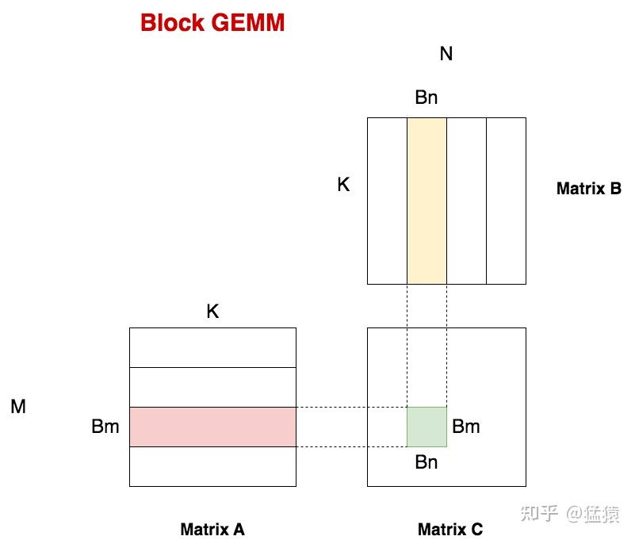
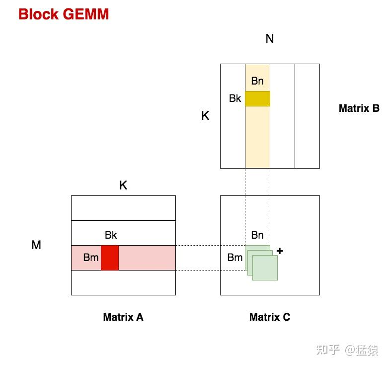
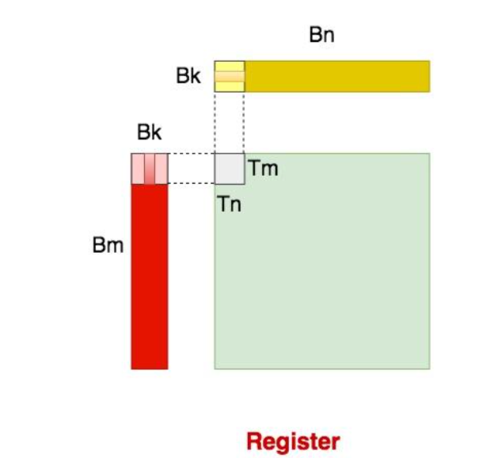

# 通用矩阵乘法 (General Matrix Multiplication, GEMM)

## 计算过程

### 1. 定义

   $C \leftarrow \alpha AB + \beta C$

   $A$ 的形状为 $M \times K$，$B$ 的形状为 $K \times N$，$C$ 的形状为 $M \times N$

### 2. 计算复杂度

   (1) 计算 $AB$ 的每个元素都有 $K$ 次乘法和 $K-1$ 次加法，共 $MN(2K-1)$ 次浮点运算

   (2) 计算 $\alpha AB$ 和 $\beta C$ 都需要 $MN$ 次乘法，共 $2MN$ 次浮点运算

   总浮点运算次数： $(2K+1)MN \approx 2KMN$ ，单位 FLOPS (Float Point Operations)

## 计算方案

### 1. naiveGEMM

   (1) 每个线程负责 $C$ 中一个元素计算，共需要 $M \times N$ 个线程

   (2) 设每个线程块维度为 $(B_m, B_n)$，如 $(32, 32)$。则 `grid` 维度为 $(\frac{M}{B_m}, \frac{N}{B_n})$

   访问次数：每个线程读取 $2K$ 个元素（ $A$ 的一行， $B$ 的一列），共读取 $2MNK$ 次

### 2. blockGEMM

   (1) 对 $C$ 切块，每个 `block` 负责 $C$ 中 $B_m \times B_n$ 大小切块的计算。则 `grid` 维度为 $(\frac{M}{B_m}, \frac{N}{B_n})$

   (2) 对于每个 `block`，需要读取 $A$ 中 $B_m \times K$ 个元素，$B$ 中 $K \times B_n$ 个元素，放到 `shared memory`。由于 $K$ 可能很大，导致 $A$ 和 $B$ 的切块无法放入 `shared memory`，因此需要进一步划分。

   
</img>

   (3) 对于每个 `block` 负责的切块，在 $K$ 维度上进一步划分为 $B_k$ 大小的块，共划分为 $\frac{K}{B_k}$ 个块，即每个 `block` 循环计算 $\frac{K}{B_k}$ 次。在每次循环中，读取 $A$ 中 $B_m \times B_k$ 个元素， $B$ 中 $B_k \times B_n$ 个元素，放到 `shared memory` 中。

   
</img>

   (4) 同理，对于每个线程也可以进行切块，分别将 $B_m$, $B_n$, $B_k$ 三个维度切分为 $T_m$, $T_n$, $T_k$ 大小的块，即每个 `thread` 循环计算 $\frac{B_k}{T_k}$ 次。在每次循环中，读取 $A$ 中 $T_m \times T_k$ 个元素， $B$ 中 $T_k \times T_n$ 个元素，放到 `register` 中。

   
</img>

   (5)  `grid` 维度为 $(\frac{M}{B_m}, \frac{N}{B_n})$ ，`block` 维度为 $(\frac{B_m}{T_m}, \frac{B_n}{T_n})$

# 参考资料

[1] [猛猿，“从啥也不会到 CUDA GEMM 优化”，知乎，2024](https://zhuanlan.zhihu.com/p/703256080)

[2] [有了琦琦的棍子，“深入浅出GPU优化系列：GEMM优化 (一) (二) (三)”，知乎，2022](https://zhuanlan.zhihu.com/p/435908830)
